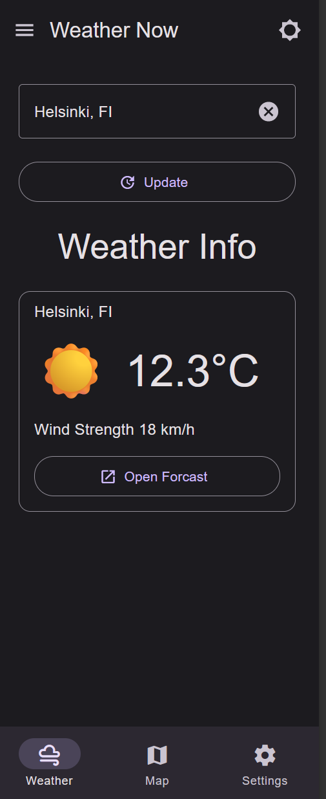
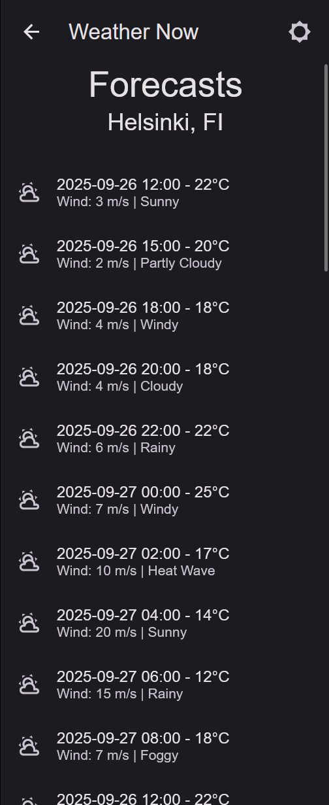
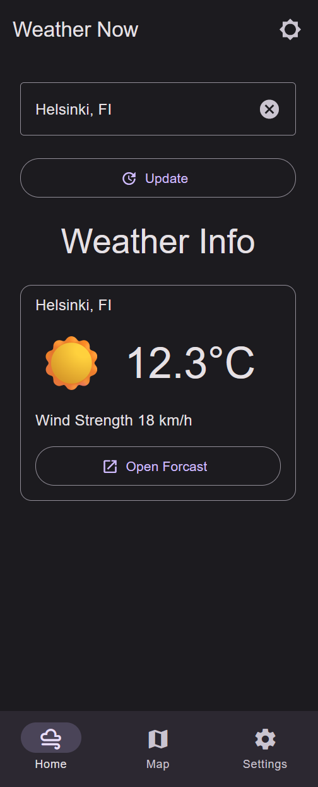
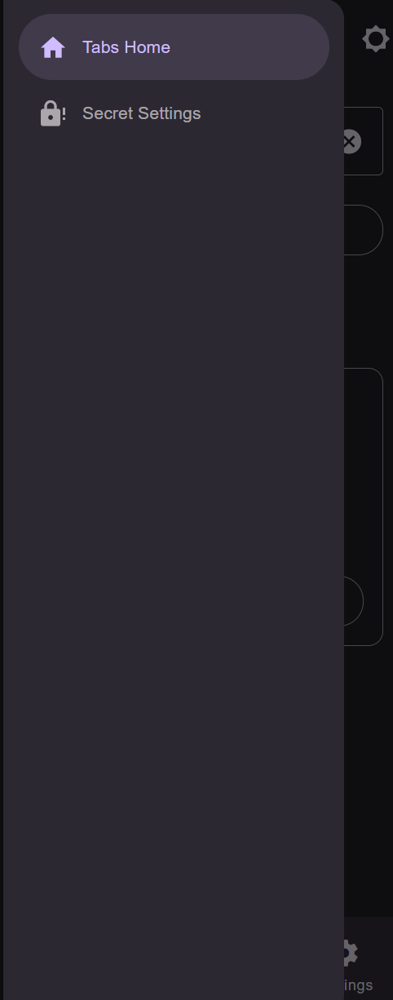
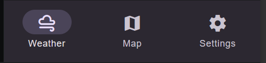
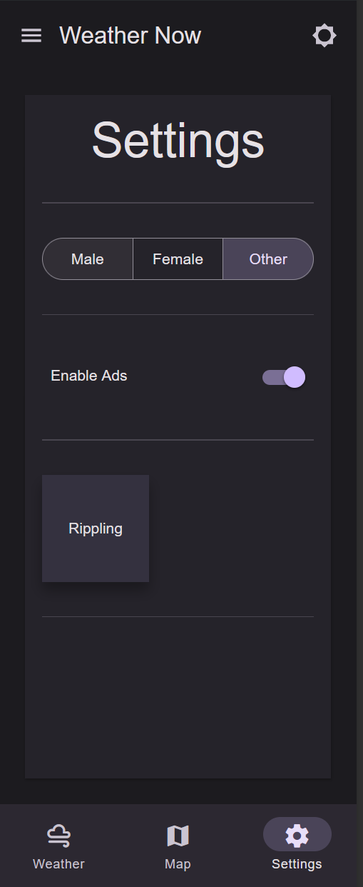

= Week 3 — Navigation, List & Fetching (React Native + Paper, Snack)

Do everything in Expo Snack using react-native-paper and React
Navigation. Keep it modular and simple.

Finished Snack Expo App:: https://snack.expo.dev/@psaitam/mobiledev-week3?platform=web

== Exercise 1 — City selector + Update (state up)

* Add a small city selector (e.g., a Paper Menu or TextInput + Clear).
* Keep the selected city in the screen's state.
* Add an Update button that refreshes the current weather card based on
the selected city.
* For now, you can still display mock values; the button must change the
city shown on the card.

Done when:: Changing the city and pressing Update updates the card's
city title.

== Exercise 2 — ``Open Forecast`` → new screen with a mock list

* Add an Open Forecast button that navigates to a Forecast screen and
passes the city.
* On the Forecast screen, show a FlatList of mock forecast items
(date/time, temp °C, wind m/s, short description).
* Render each row with a small, reusable list item component.
* Select one navigation pattern (e.g. bottom tabs) and try at least some
other pattern (e.g. drawer).
* Add screenshots of both. Which one is better in your opinion?

Done when:: The button navigates, and the forecast screen shows a
scrollable mock list with neat rows.

Finished UI::
I extended the app state from last weeks exercise and implemented the functionality from this task. The city selector can now change the displayed city name of the current weather card. This can be done by pressing the update button. After a short delay (loading simulation) the card is updated.

+
In addition, I added the button to navigate to the forecast screen. The city name is passed through the navigation parameters and displayed in the list-header. The list is scrollable and contains mock data.

+
Also, I experimented with react navigation and the different navigation patterns. I implemented both a bottom tab navigation and a drawer navigation, as well as a stack navigation. I had some issues with the drawer navigation and using multiple navigators, because the Header was owned by the wrong navigator. I solved this by rearranging the nesting of the navigators. I learnt that Navigation can be quite tricky and should be planned ahead. Navigation is critical for the user experience and should be chosen wisely.

Navigatoin Pattern chosen:: 
Bottom Tabs
+

+
Drawer

+

Which one is better::
In my opinion, the Bottom Tabs navigations is better for this app. It provides and easy and quick access to the main screens of the app. However, this only works because there currently aren't many different screens. If there were more screens, the Drawer is a better choice, as it can handle more items in a separate menu, without filling up the main screen.

== Exercise 3

* Get familiar with a couple of more react native paper components and
use them in your UI Mock-Up.
* Add screenshots in your submission (PDF or Word).

Chosen components::

Bottom Tabs, Paper integration with React Navigation

+

+
Additionally, played around with some other Paper components like: Surface, Segmented Buttons, TouchableRipple, Switch and Divider

+

+
It is quite easy to integrate the Paper components with the documentation. It's also interesting to see how the Form-Components follow the same pattern with providing the value and onChange props. This makes it easy to control them in the parent component.

== What to submit

* Snack or Git link + a few lines describing what you finished in each
exercise and screenshots of Current & Forecast.
* Add also your personal findings and lessons learned in your
submission.
