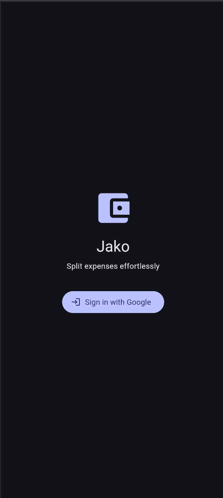
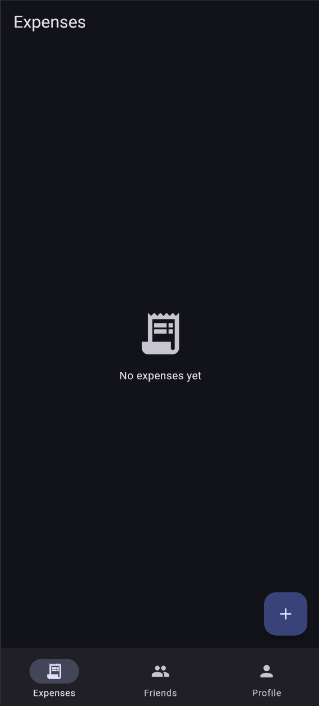
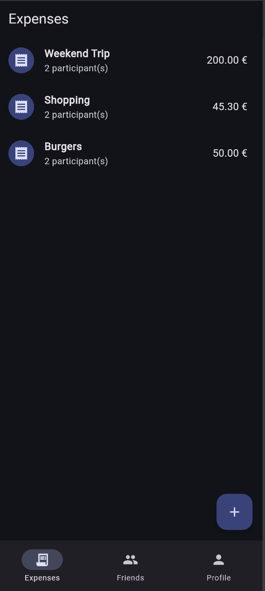
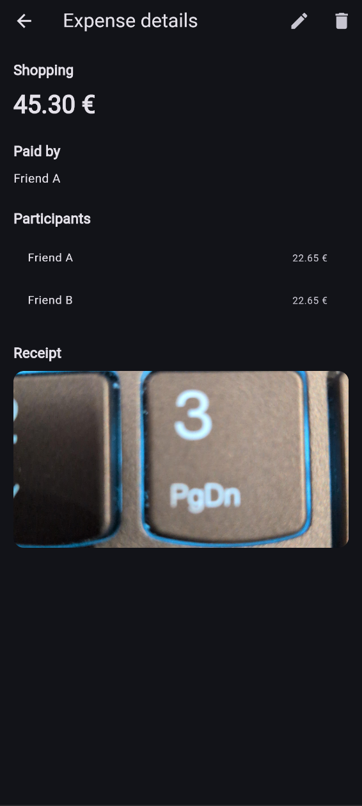
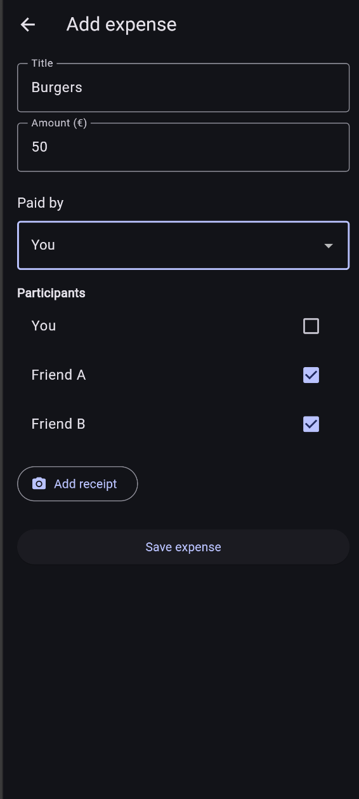
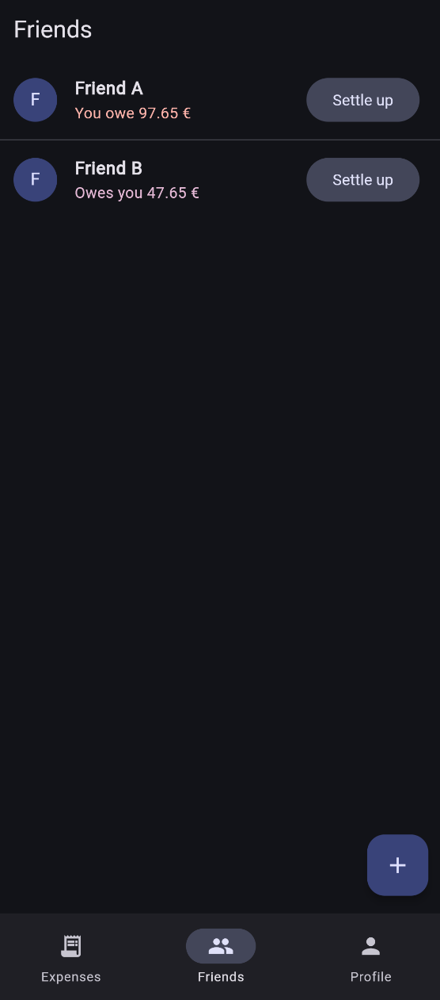
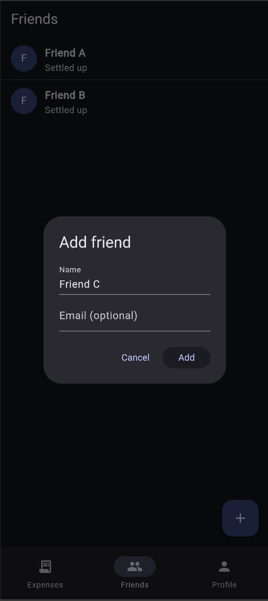
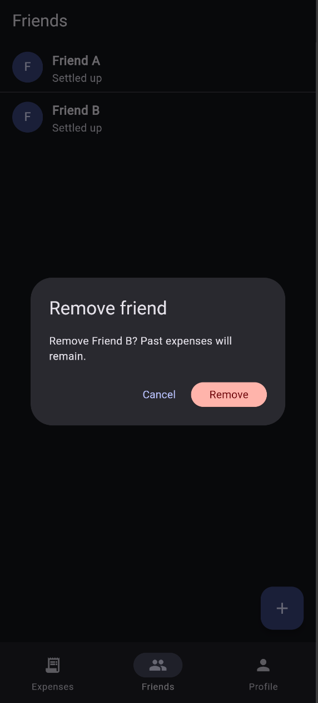

# Jako – Group Expense Tracking App

## App Description

**Jako** is a mobile and web application for tracking shared expenses between friends.  
The idea is to make it easy to keep track of who paid for what and who owes whom, without having to manually calculate balances.

Users can sign in with their Google account, add friends, record expenses, and optionally attach a photo of the receipt using the device camera. Expenses can be split between multiple participants, and the app automatically calculates balances for each friend.

The application is built using **Flutter** and uses **Firebase** for authentication, database storage, and file storage. The UI follows **Material 3** guidelines to keep the design modern and consistent across platforms.

The app is mainly targeted at students and small friend groups who want a simple way to manage shared costs such as food, trips, or other everyday expenses.

---

## Screenshots

### Login



### Expenses

Empty expenses list
  

Expenses list
  

Expense details


### Adding and Deleting Expenses

Add expense
  

Delete expense


### Friends and Balances

Friends list
  

Friends balances
  

Add friend
  

Delete friend (press and hold)


### Profile


---

## Essential Parts and Components

### Google Authentication (Firebase Auth)

```dart
Future<void> signInWithGoogle() async {
  final auth = FirebaseAuth.instance;
  final provider = GoogleAuthProvider();

  if (kIsWeb) {
    await auth.signInWithPopup(provider);
  } else {
    await auth.signInWithProvider(provider);
  }
}

```

This handles Google sign-in for both mobile and web platforms using Firebase Authentication.

### Backend Connection (Cloud Firestore)

```dart

Stream<List<Expense>> watchExpenses() {
  return _expensesRef()
      .orderBy('createdAt', descending: true)
      .snapshots()
      .map((snapshot) {
        return snapshot.docs
            .map((doc) => Expense.fromFirestore(doc.id, doc.data()))
            .toList();
      });
}
```

Expenses are stored in Cloud Firestore and streamed in real time so that changes appear immediately in the UI.

### Device Feature Usage (Camera + Firebase Storage)

```dart
final image = await ImagePicker().pickImage(
  source: ImageSource.camera,
  imageQuality: 75,
);
```

```dart
await storageRef.putFile(File(image.path));
final imageUrl = await storageRef.getDownloadURL();
```

The app allows users to take a photo of a receipt and upload it to Firebase Storage, where it can later be viewed from the expense details.

### State Management (Riverpod)

```dart
final expensesStreamProvider = StreamProvider<List<Expense>>((ref) {
  return ref.read(expensesRepositoryProvider).watchExpenses();
});
```

Riverpod is used for app-wide state management, providing a clean and reactive way to handle authentication, data streams, and UI updates.

### Navigation Between Pages

```dart
Navigator.of(context).push(
  MaterialPageRoute(
    builder: (_) => ExpenseDetailsPage(expense: expense),
  ),
);
```

The app uses standard Flutter navigation with multiple screens and tab-based navigation.

## Own Reflections and Learning

This project helped me understand how a real-world Flutter application is structured from start to finish. I learned how to connect a Flutter app to Firebase services, manage user authentication, and design a data model that works well with Cloud Firestore. Although I have never worked with flutter before, I quickly noticed some of the similarities to how React Native Apps are set up and how they differ from flutter apps.  

One of the main challenges was handling differences between mobile and web platforms, especially for Google sign-in and image loading. Solving these issues improved my understanding of platform-specific behavior in Flutter.  

I also learned how important proper state management is when building larger applications. Using Riverpod made the code more maintainable and easier to reason about. Because we looked at the zustand library for React Native, I wanted to integrate a proper state management system to my flutter app as well.

If the project were extended further, I would like to add shared group expenses between multiple users, better offline support, and more advanced profile customization. I discarded the main idea of synchronizing expenses live over across app users, as it turned out to be very complex. Another fun idea would be to add a scan-receipt function, where the photographed receipts would be split into items which then could be assigned to individual people. However, this is also very challenging and hard to do while maintaining good UX.